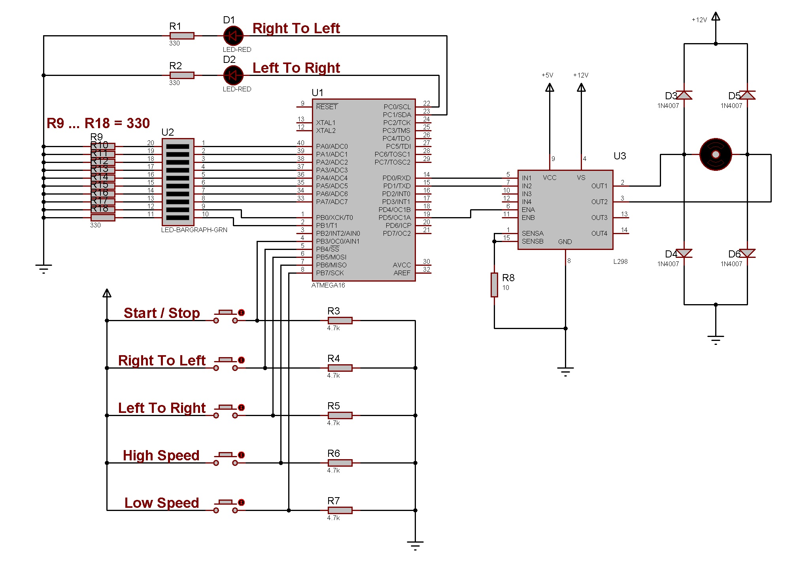

# AVR DC Motor Driver

 

### This repository is DC Motor Driver.

Because the motor consumes high current, MCU cannot control the motor directly. It requires a driver IC like L293 to control the motor. L293 is a most popular and less expensive built-in H-bridge in a small integrated circuit used for low current motors freewheeling diodes are used to avoid problems due to back emf.The motor speed can be adjusted in 10 levels. The direction of rotation of the motor is adjustable. The top two LEDs show the direction of rotation and the 10th LED bar shows the motor speed.
###### This repository contains Source Files & Proteus Circuit Simulation Files. 

---

 
